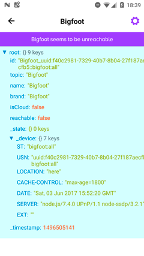

# The Bigfoot project

A toolbet for IoT software tools that work together.

1. Discover devices automatically
2. Have premade or many compatible user interfaces
3. Simple, lightweight APIs

## How does it work?


# Get started

This guide will allow you to mock up your first connected device in less than a minute.

1. **Download [Yeti Smart Home](https://getyeti.co/)**

Any Bigfoot-compatible software would work. By the moment Bigfoot is fairly young, so this is the first end user software tool that supports it. You can also help open source software as [Netbeast Dashboard](https://github.com/netbeast/dashboard) implement it.

2. **Choose a sample scaffold from the Bigfoot Project**.

```
git clone https://github.com/netbeast/bigfoot-node
cd bigfoot-node/samples/mock-device
npm install
npm start
```

This is a sample in node.js. There are also in [bigfoot-golang](https://github.com/netbeast/bigfoot-golang). We are looking for collaborators to create samples in other languages such as lua or python. Please send us a pull request!

3. **Explore devices in Yeti**

Done 👏🏽

# Discovery
Allow your device to be discovered by Yeti or any other Bigfoot  client.

```js
var Server = require('node-ssdp').Server

server = new Server({
  sourcePort: 1900,
  udn: 'my-unique-string-identidier', 
})

server.addUSN('bigfoot:all')

server.start()

process.on('exit', function() {
  server.stop() // advertise shutting down and stop listening
})
```

Check out the repo for examples in [golang](https://github.com/netbeast/bigfoot/tree/master/samples/golang) or other languages.

Congratulations, your device is alive!




At the right you have the bare values of your device. It still has no functionality, so it will fail when you try to control it. Let's keep learning.

### Ping

This is intended to be the most lightweight method to check that connectivity to your device works. If you implement an interface through HTTP \(as described in [skills](/skills.md)\) we'd only need to specify the port where the service is running as the **location** parameter:

```js
const Ssdp = require('node-ssdp')
const express = require('express')
const app = express()

// respond with "hello world" when a GET request is made to the homepage
app.get('/', function (req, res) {
  res.send('hello world')
})

const httpServer = app.listen(3000, function () {
  const addr = httpServer.address().address
  const port = httpServer.address().port
  console.log('👾  Bigfoor ping sample started on %s:%s', addr, port)

  ssdpServer = new Ssdp.Server({
    location: `${addr}:${port}`,
    sourcePort: 1900,
  })
  ssdpServer.addUSN('bigfoot:all')
  ssdpServer.start()
})

process.on('exit', function() {
  ssdpServer.stop() // advertise shutting down and stop listening
  app.stop() // close express server
})
```

As you'd notice already, our device is still pretty dumb. We can only see it appear in our Yeti \(Bigfoot compatible\) device. This is because we had not specify any skill or topic that it can work as. So let's move on now.

# Skills
We can now already expose a webview for our connected device to a Bigfoot compatible software:

```js
// node/samples/webapp
const Ssdp = require('node-ssdp')
const express = require('express')
const ip = require('ip')
const app = express()

// Serve a web application to use as user interface or show data
app.use(express.static('public'))

const httpServer = app.listen(3000, function () {
  const addr = httpServer.address().address
  const port = httpServer.address().port
  console.log('👾 Bigfoot webapp example started on %s:%s', addr, port)

  ssdpServer = new Ssdp.Server({
    location: `http://${ip.address()}:${port}`,
    udn: 'Bigfoot_very-unique-bigfoot',
    sourcePort: 1900,
  })
  ssdpServer.addUSN('bigfoot:web')
  ssdpServer.start()
})

process.on('exit', function() {
  ssdpServer.stop() // advertise shutting down and stop listening
  app.stop() // close express server
})
```

After discovery or a request for your skills descriptor you must be able to communicate the things you are able to do, and let the other parties understand. Skills are grouped in _topics_, so when you declare a topic every other Bigfoot compatible machine understands how to communicate with it immediately.

To declare an interface you'd only need to specify the topic on the USN:

```js
ssdpServer.addUSN('bigfoot:bulb')
// or 
ssdpServer.addUSN('bigfoot:app')
```

And Bigfoot compatible devices are going to interpret it as different devices.

### Available topics
* `App`: exposes an app through a webserver, so the developer can implement its own interface.
* `Bridge`: a device that can find and talk to other devices
* `Bulb`: to control lightning systems
* `Music` : things that can consume 
* `Thermostat`: a heat / cold system
* `Switch`: a plug or system with two states \(on/off\)

## Implementing a topic

To understand Bigfoot messages you only must implement a protocol to listen for the primites and then specify it under location. The switch topic is the simplest because you only have to understand ON / OFF set requests and to return the state. This will be done by HTTP POST and GET methods respectively.

```js
// node/samples/mock-device
const Ssdp = require('node-ssdp')
const express = require('express')
var bodyParser = require('body-parser')
const ip = require('ip')
const app = express()

let state = {
  power: 1,
  color: '#ffff00',
  brightness: 80,
  temperature: 50,
}

app.use(bodyParser.json())

app.get('/', function (req, res) {
  // Here you can return the switch state
  console.log('\n State requested:')
  console.log(state)
  res.json(state)
})

app.post('/', function (req, res) {
  // Maybe perform some validation, change any device internal handling and then
  // return back the state
  state = req.body.state || state
  console.log('\n State changed:')
  console.log(state)
  res.json(state)
})

const httpServer = app.listen(3000, function () {
  const addr = httpServer.address().address
  const port = httpServer.address().port
  console.log('👾 Bigfoot device mock started on %s:%s', addr, port)

  ssdpServer = new Ssdp.Server({
    suppressRootDeviceAdvertisements: true,
    location: `http://${ip.address()}:${port}`,
    sourcePort: 1900,
  })
  ssdpServer.addUSN('bigfoot:bulb')
  ssdpServer.start()
})

process.on('exit', function() {
  ssdpServer.stop() // advertise shutting down and stop listening
  app.stop() // close express server
})
```

Topics stand for a _kind_ of device and groups a set of variables or dimensions to be used. It is a shortcut for the skills of a Device. For example if the topic of your thing is _light_ or _bulb_ the rest of the parties will immediately know that you must support a certain state:

```js
/* @flow */
export type BulbState = {
  power: 0 | 1,
  brightness: number, // percentage 0-100
  hue?: number, // degrees 0-360
  saturation?: number, // percentage 0-100
  color?: string, // hex conversion of the values above
}
```

\*\_ [Flow](https://flow.org/) is used to describe data types and interfaces throughout the codebase

These are the topics supported by Netbeast Dashboard so far:

```js
/* @flow */
export type BulbState = {
  power: 0 | 1,
  brightness: number, // percentage 0-100
  hue?: number, // degrees 0-360
  saturation?: number, // percentage 0-100
  color?: string, // hex conversion of the values above
}

export type SwitchState = { power: PowerState }

export type MusicState = {
  status: 'playing' | 'paused',
  volume: number, // Not sure still that this is a percentage
  track: Url,
  position?: number,
  playlist?: Array<Object>,
  // rest to be defined
}

export type ThermostatState = {
  power: 0 | 1,
  temperature: number,
  units: 'celsius', 'farenheit',
  mode?: string,
}
```

## Create a bridge
You can use special topics as `app` or `bridge` to connect with devices that are outside current compatible protocols.

The only difference is that the `state` that we must return is an array of devices.

## Roadmap

* [x] Define the scope of the project
* [x] [Website](https://netbeast.github.io/bigfoot/)
* [ ] Open channels for collaborators \(chats, forums or emails\)
* [ ] Write strategies
  * [x] Get Started
  * [x] Discovery
  * [x] Ping
  * [x] setState
  * [ ] Pairing devices
  * [ ] Reactive events
  * [ ] Notifications
* [ ] Node.js 
  * [x] Code samples
  * [x] Working samples with virtual devices
  * [x] Working samples with real devices
* [ ] Go
  * [x] Code samples
* [ ] Python
  * [x] Code samples

## But you are still offering a protocol?

Not at all. Bigfoot project aims to gather a set of strategies over existing protocols and industry standards to make it easier for developers and makers to create IoT experiences together. As React brought us that to representation interfaces, Bigfoot wants you to be able to create React-like hardware responses in a network environment with a set of simple and functional APIs.

Bigfoot _topics_ is a suggested data structure that works out of the box with other tools in the belt. Because, you know, we need things working together. Anyway those _topics_ are borrowed from many other smart home devices, IoT services and other stablished protocols. We are going to build _translators_ so you can use this schema as a middleware utility. But it is **not opinionated** and completely optional. As a fact they will have a `raw` method alternative to access all the params obscured by any tools, in case you want access to the internals of the things you are working with.

# Contributing

Bigfoot is an Open Source Project. This means that:

> Individuals making significant and valuable contributions are given commit-access to the project to contribute as they see fit. This project is more like an open wiki than a standard guarded open source project.

See the [CONTRIBUTING.md](CONTRIBUTING.md) file for more details.

# Sponsors

This project is a reality today thanks to its contributors and sponsors. 
We are proud to be part of the Toptal Open Source grant program, and compatible with Yeti

<a href="https://getyeti.co" target="_blank">
   
</a>

<a href="https://www.toptal.com/" target="_blank">
  
</a>

